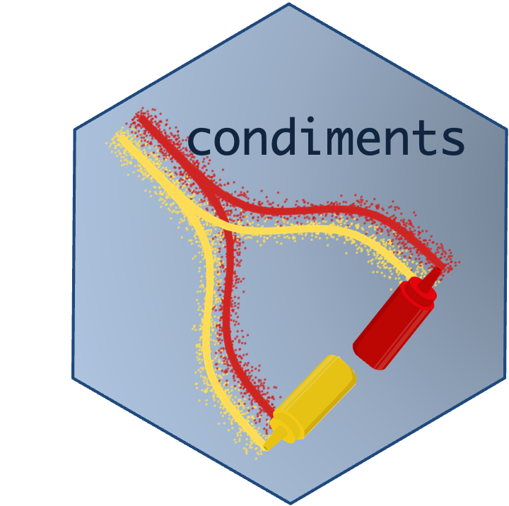

# Trajectory inference across conditions: differential topology, progression and expression

# Overview

## Instructor(s) name(s) and contact information

 - Hector Roux de Bézieux (hector.rouxdebezieux@berkeley.edu)
 - Kelly Street (kstreet@ds.dfci.harvard.edu)
 - Koen Van den Berge (koenvdberge@berkeley.edu)
 
## Workshop Description

In single-cell RNA-sequencing (scRNA-seq), gene expression is assessed at the level of single cells. In dynamic biological systems, it may not be appropriate to assign cells to discrete groups, but rather a continuum of cell states may be observed, e.g. the differentiation of a stem cell population into mature cell types. This is often represented as a trajectory in a reduced dimension of the scRNA-seq dataset.

Many methods have been suggested for trajectory inference. However, in this setting, it is often unclear how one should handle multiple biological groups or conditions, e.g. constructing and comparing the differentiation trajectory of a wild type versus a knock-out stem cell population.

In this workshop, we will explore methods for comparing multiple conditions in a trajectory inference analysis. We will expand on our recent package [condiments](https://bioconductor.org/packages/devel/bioc/html/condiments.html) and present the workflow on two examples. 

We will first present a _single-lineage trajectory dataset with two conditions_ which we call **TGFB**, and conduct a full workflow analysis on that dataset, from integration to differential expression. You can find the compiled version of that vignette [here](https://hectorrdb.github.io/bioc2021trajectories/articles/TGFB.html).

+ We will then analyze a more complex dataset, with _three lineages and three conditions_, which we name **KRAS** and explore how the first few steps of the workflow differ. You can find the compiled version of that vignette [here](https://hectorrdb.github.io/bioc2021trajectories/articles/KRAS.html).

## Pre-requisites

Software:

* Basic knowledge of _R_ syntax
* Familiarity with single-cell RNA-sequencing
* Familiarity with the `SingleCellExperiment` class

Background reading:

* The textbook "Orchestrating Single-Cell Analysis with Bioconductor" is a great reference for single-cell analysis using Bioconductor packages.
* The first dataset used in this workshop was originally published in [McFaline-Figueroa, et al.](https://www.nature.com/articles/s41588-019-0489-5) "A pooled single-cell genetic screen identifies regulatory checkpoints in the continuum of the epithelial-to-mesenchymal transition."
* The second dataset used in this workshop in [Xue, et al.](https://doi.org/10.1038/s41586-019-1884-x) "Rapid non-uniform adaptation to conformation-specific KRAS(G12C) inhibition"
* [Slingshot paper](https://bmcgenomics.biomedcentral.com/articles/10.1186/s12864-018-4772-0)
* [tradeSeq paper](https://www.nature.com/articles/s41467-020-14766-3)
* [condiments paper](https://www.biorxiv.org/content/10.1101/2021.03.09.433671v1)

## Workshop Participation

The workshop will start with an introduction to the problem and the first dataset using [presentation slides](). Following this, we will have a [lab session on the first dataset](https://hectorrdb.github.io/bioc2021trajectories/articles/TGFB.html). Time permitting, we will then look at [a second dataset](https://hectorrdb.github.io/bioc2021trajectories/articles/KRAS.html).

## _R_ / _Bioconductor_ packages used

* The workshop will focus on Bioconductor packages [SingleCellExperiment](https://bioconductor.org/packages/release/bioc/html/SingleCellExperiment.html), [Slingshot](https://bioconductor.org/packages/release/bioc/html/slingshot.html), [tradeSeq](https://bioconductor.org/packages/release/bioc/html/tradeSeq.html) and [condiments](https://bioconductor.org/packages/devel/bioc/html/condiments.html).

### Time outline

| Activity                     | Time |
|------------------------------|------|
| Introduction                     | 10m  |
| TGFB: Data Integration   | 5m  |
| TGFB: Trajectory Inference and Differential Topology   | 10m  |
| TGFB: Differential Progression                    | 5m  |
| TGFB: Differential Expression          | 10m  |
| KRAS: Trajectory Inference and Differential Topology   | 10m  |
| KRAS: Differential Progression and Differentiation     | 5m  |
| Wrap-up and Conclusions          | 5m  |

## Workshop goals and objectives

Participants will learn how to reason about trajectories in single-cell RNA-seq data and how they may be used for interpretation of complex scRNA-seq datasets. Participants can follow along in the following fashions:

+ Run the code online by going to [orchestra](http://app.orchestra.cancerdatasci.org/1) and launching the workshop titled __Trajectory inference across conditions: differential expression and differential progression__
+ Clone the [repository](https://github.com/hectorrdb/bioc2021trajectories) from github and run the code locally
+ USe docker and get the container hectorrdb/bioc2021trajectories:latest

## Learning goals

* Reason about dynamic biological systems.
* Grasp the complexity of analyzing large scRNA-seq datasets with the goal of extracting relevant biological information.
* Understand the concepts of differential progression and differential expression along a trajectory path.

## Learning objectives

* Learn how to analyze single-cell RNA-seq data using Bioconductor packages.
* Import and explore large scRNA-seq datasets.
* Understand the challenges of trajectory inference.
* Compose analysis pipeline that allows interpretation of complex scRNA-seq datasets.
* Assess the added complexity of handling multiple conditions in these dynamic systems and how it influences the analysis pipeline.
* Discuss how the analysis pipeline can incorporate this change and evaluate it.

# Final notes

A compiled version of the vignette is available on the [workshop website](https://hectorrdb.github.io/bioc2021trajectories/articles/bioc2021trajectories.html).

If you have questions that you could not ask during the workshop, feel free to open an issue on the github repository [here](https://github.com/hectorrdb/bioc2021trajectories/issues).
