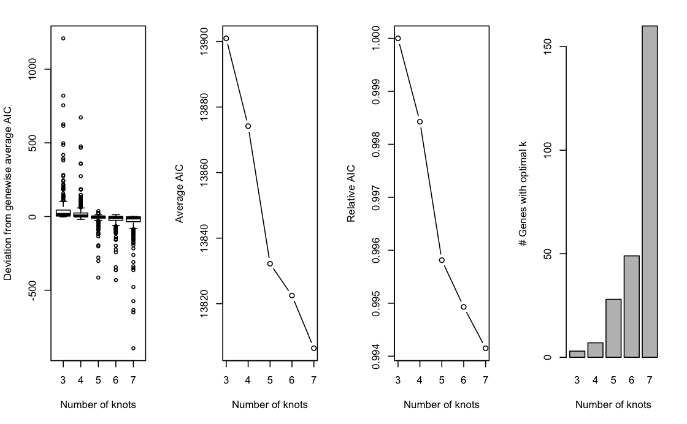

# Overview

```{r}
library(knitr)
opts_chunk$set(
  eval = TRUE
)
```


We will follow the 3-steps workflow of the `condiments` package:

+ We start by integrating datasets from multiple conditions and then check if we can fit a single trajectory, which we call **differential topology**.
+ By comparing the conditions along the trajectory's path, we can detect large-scale changes, indicative of **differential progression**. 
+ We also demonstrate how to detect subtler changes by finding genes that exhibit different behaviors between these conditions along a differentiation path, commonly known as **differential expression**.

```{r}
suppressPackageStartupMessages({
  library(slingshot); library(SingleCellExperiment)
  library(dplyr); library(condiments);
  library(RColorBrewer); library(scales)
  library(viridis); library(UpSetR)
  library(pheatmap); library(msigdbr)
  library(fgsea); library(knitr)
  library(ggplot2); library(gridExtra)
  library(tradeSeq); library(cowplot)
})
theme_set(theme_classic())
```

# Analysis

## Dataset

The dataset we will be working with concerns a single-cell RNA-sequencing dataset consisting of two different experiments, which correspond to two treatments. [McFaline-Figueroa et al.](https://www.nature.com/articles/s41588-019-0489-5) studied the epithelial-to-mesenchymal transition (EMT), where cells spatially migrate from the epithelium to the mesenchyme during development. This process will be described by a trajectory, reflecting the gene expression changes occurring during this migration. The authors furthermore studied both a control (`Mock`) condition, and a condition under activation of transforming growth factor $\beta$ (TGFB).

In summary, we will be investigating a trajectory consisting of a single lineage that represents the EMT. This lineage is studied in two different conditions; a control condition and a TGFB-induced condition.

## Integration

Our dataset contains cells collected from samples undergoing two different treatment conditions which were necessarily collected separately. Hence, we will start with an integration step to combine these two sets of cells, similar to batch correction. Our goal is to remove the technical effects of the different sample collections while preserving any true, biological differences between the two treatment groups.

Data integration and normalization are complex problems and there are a variety of methods addressing each. Interested participants can explore [the corresponding chapter of the Bioconductor Ebook](http://bioconductor.org/books/release/OSCA/integrating-datasets.html). However, since neither is the main focus of this workshop, we elected to use an existing pipeline for these tasks. The full Seurat data integration workflow with SCTransform normalization is described in [this vignette](https://satijalab.org/seurat/v3.1/integration.html).

Since this whole step is quite slow, it will not be run during the workshop but the code is provided below, along with a function to download and preprocess the public data from GEO.

```{r integration, eval = FALSE}
tgfb <- bioc2021trajectories::import_TGFB()

########################
### Split by condition and convert to Seurat
########################
assays(tgfb)$logcounts <- log1p(assays(tgfb)$counts)
tgfbMock <- tgfb[, tgfb$treatment_id == 'Mock']
tgfbTGFB <- tgfb[, tgfb$treatment_id == 'TGFB']
library(Seurat)
soMock <- as.Seurat(tgfbMock)
soTGFB <- as.Seurat(tgfbTGFB)

########################
### Normalize
########################
soMock <- SCTransform(soMock, verbose = FALSE)
soTGFB <- SCTransform(soTGFB, verbose = FALSE)

########################
### Integrate
########################
dtlist <- list(Mock = soMock, TGFB = soTGFB)
intfts <- SelectIntegrationFeatures(object.list = dtlist, nfeatures = nrow(tgfb)) # maxes out at 4080 (why?)
dtlist <- PrepSCTIntegration(object.list = dtlist,
							 anchor.features = intfts)
anchors <- FindIntegrationAnchors(object.list = dtlist, normalization.method = "SCT",
								  anchor.features = intfts)
integrated <- IntegrateData(anchorset = anchors, normalization.method = "SCT")
integrated <- RunPCA(integrated)
integrated <- RunUMAP(integrated, dims = 1:50)

## convert back to singleCellExperiment
tgfb <- as.SingleCellExperiment(integrated, assay = "RNA")
tgfb <- tgfb[, sample(ncol(tgfb))]
```


## Import dataset

We have made the pre-processed, integrated dataset available as a `SingleCellExperiment` object in the workshop package, which we import below.

```{r}
data("tgfb", package = "bioc2021trajectories")
```


## Exploration

Once the two datasets have been integrated, we can visualize all the single cells in a shared reduced dimensional space. 

We also visualize the distribution of cells in this space according to the treatment (control and TGFB) and spatial location (inner cells versus outer cells).

```{r compute scores}
df <- bind_cols(
  as.data.frame(reducedDims(tgfb)$UMAP),
  as.data.frame(colData(tgfb)[, !colnames(colData(tgfb)) == "slingshot"])
  )
ggplot(df, aes(x = UMAP_1, y = UMAP_2, col = treatment_id)) +
  geom_point(size = .7) +
  scale_color_brewer(palette = "Accent") +
  labs(col = "Treatment")

ggplot(df, aes(x = UMAP_1, y = UMAP_2, col = spatial_id)) +
  geom_point(size = .7) +
  scale_color_brewer(palette = "Dark2") +
  labs(col = "Spatial ID")
```


We know from biological knowledge that the EMT development goes from the inner to the outer cells. The question is: should we fit a separate trajectory for each condition? We might expect the trajectory itself to be changed by the treatment if the treatment effect is systematically large. Otherwise, the treatment may impact the expression profile of some genes but the overall trajectory will be preserved. 

To help assess this, we devised an imbalance score. Regions with a high score indicate that the local cell distribution according to treatment label is unbalanced compared the overall distribution. Here, we see that, while there are some small regions of imbalance, the global path along the development axis is well-balanced. This means that we should be able to fit a global trajectory to the full dataset. 

```{r}
library(condiments)
tgfb <- condiments::imbalance_score(tgfb, conditions = tgfb$treatment_id,
                                      k = 20, smooth = 40, dimred = "UMAP")
df$scores <- tgfb$scores$scaled_scores
ggplot(df, aes(x = UMAP_1, y = UMAP_2, col = scores)) +
  geom_point(size = .7) +
  scale_color_viridis_c(option = "C") +
  labs(col = "Scores")
```

For more information on the score, run `help("imbalance_score", "condiments")`

We can also rely on a more principled approach, using the `topologyTest`.

## Differential Topology and Trajectory Inference

We perform trajectory inference to order the cells according to EMT progression. We  use `slingshot` for trajectory inference, with the cells' position (inner or outer) serving as the cluster identifier. This ensures that we will only find a single lineage while still allowing sufficient flexibility to correctly orient the pseudotime axis. We first fit a common trajectory to extract the skeleton.

```{r slingshot}
library(slingshot)
tgfb <- slingshot(tgfb, reducedDim = 'UMAP', clusterLabels = tgfb$spatial_id,
                 start.clus = 'inner', approx_points = 150)
# tgfb@int_metadata$slingshot <- tgfb$slingshot
mst <- slingMST(tgfb, as.df = TRUE)
ggplot(df, aes(x = UMAP_1, y = UMAP_2, col = spatial_id)) +
  geom_point(size = .7, alpha = .3) +
  scale_color_brewer(palette = "Dark2") +
  labs(col = "Spatial ID") +
  geom_path(data = mst, col = "black", size = 1.5) +
  geom_point(data = mst, aes(col = Cluster), size = 5)
```

```{r, eval = FALSE}
set.seed(100)
topologyTest(tgfb, conditions = tgfb$treatment_id, rep = 100)
```


We fail to reject the null that the trajectories are different and we keep the common trajectory. This choice allows us to use the maximal amount of data in the construction of our trajectory, which should lead to more robust results than separate, potentially noisy trajectories constructed on subsets of the data. As we will see, not all cell types are necessarily present in every condition, so this approach ensures that our trajectory accounts for all cell types present in the overall data. 

```{r plotSlingshot}
df$pseudotime <- slingPseudotime(tgfb)
# Plot the MST
curves <- slingCurves(tgfb, as.df = TRUE)
ggplot(df, aes(x = UMAP_1, y = UMAP_2, col = pseudotime)) +
  geom_point(size = .7) +
  scale_color_viridis_c() +
  labs(col = "Pseudotime") +
  geom_path(data = curves, col = "black", size = 1.5)
```

```{r}
df <- as.data.frame(colData(tgfb)[,-10])
ggplot(df, aes(x = slingPseudotime_1, fill = spatial_id, col = spatial_id)) +
  geom_density(alpha = .7, size = 1.5) +
  scale_fill_brewer(palette = "Dark2") +
  scale_color_brewer(palette = "Dark2") +
  labs(fill = "Spatial ID", col = "Spatial ID", x = "Pseudotime")
```

## Differential progression

Now that we have ordered the cells by EMT progression, we can begin to address the main question: how is this progression affected by TGF-$\beta$ treatment? In this section, we interpret this question as a univariate analysis of the pseudotime values between the two groups.

```{r plotDensities}
ggplot(df, aes(x = slingPseudotime_1, fill = treatment_id, col = treatment_id)) +
  geom_density(alpha = .7, size = 1.5) +
  scale_fill_brewer(palette = "Accent") +
  scale_color_brewer(palette = "Accent") +
  labs(fill = "Treatment ID", col = "Treatment ID", x = "PSeudotime")
```

The density estimates for the two groups show a trimodal distribution for the untreated cells, but a tendency toward later pseudotime values in the TGF-$\beta$ treated cells. The difference is striking enough that a standard T-test would likely be significant, but we are we are interested more generally in differences between the two distributions, not just the difference of means (one could imagine a scenario in which the treated group tended toward the extremes, but the means were the same). Hence, we propose a Kolmogorov-Smirnov Test to assess whether the two groups of pseudotime values are derived from the same distribution. For more info on the Kolmogorov-Smirnov Test, see [here](https://en.wikipedia.org/wiki/Kolmogorov%E2%80%93Smirnov_test).

```{r}
progressionTest(tgfb, conditions = tgfb$treatment_id)
```

As we might expect from the plot, this test is highly significant, so we can conclude that there are differences between the two distributions.

## Differential expression

We will now proceed to discover genes whose expression is associated with the inferred trajectory. We will look for genes that (i) change in gene expression along the trajectory, and (ii) are differentially expressed between the two conditions along the trajectory. The differential expression analysis uses the Bioconductor package `tradeSeq`. This analysis relies on a new version of `tradeSeq`, which we have recently updated to allow for multiple conditions.

For each condition (i.e., control and TGF-Beta), a smooth average expression profile along pseudotime will be estimated for each gene, using a negative binomial generalized additive model (NB-GAM).
Each differential expression hypothesis of interest will then be translated into testing specific features (a linear combination of the parameters) of this smoothed expression estimate.
See [here](https://www.maths.ed.ac.uk/~swood34/mgcv/) for more information on smoothers and the `mgcv` package which we are using to estimate the smoothers.

The next two paragraphs can be time-consuming so we will not run them during the workshop, however, their output is already present in the data object that was loaded at the start of this workshop. They can be easily parallelized, relying on the `BiocParallel` bioconductor package. See [here](https://statomics.github.io/tradeSeq/articles/fitGAM.html#parallel-computing-1) for more details.

### Select number of knots

Before we can fit these smoothed expression profiles, we need to get a sense of how complex the expression patterns are in this dataset. This is translated into selecting a number of knots for the NB-GAMs, where a higher number of knots allows for more complex expression patterns. Here, we pick $5$ knots.


```{r evaluateK, eval = FALSE}
set.seed(3)
icMat <- evaluateK(tgfb, conditions = factor(colData(tgfb)$treatment_id),
                   nGenes = 300,
                   k = 3:7)
```

```{r, echo=FALSE}

```

The plot above shows the graphical output from running `evaluateK`. The left panel shows the distribution of gene-level AIC values as compared to their average AIC over the range of `k`. The second and third panel plot the average AIC and relative AIC with respect to the lowest value of `k` (i.e., 3), respectively, as a function of `k`. Finally, the right panel plots the number of genes whose AIC is lowest at a particular value of `k`.

Choosing an appropriate value of `k` can be seen as analogous to choosing the number of principal components based on a scree plot: we look for an 'elbow point', where the decrease starts attenuating. Here, we choose `k=5` to allow for flexible, yet simple, functions while limiting the computational burden. In general, we found the influence of choosing the exact value of `k` to be rather limited, unless `k` is arbitrarily small or large. In our evaluations, most datasets fall within the range of $4$ to $8$ knots.

### Fit GAM

Next, we fit the NB-GAMs using 5 knots, based on the pseudotime and cell-level weights estimated by Slingshot. We use the `conditions` argument to fit separate smoothers for each condition.

```{r, eval = FALSE}
set.seed(3)
metadata(tgfb)$slingshot <- SlingshotDataSet(tgfb)
tgfb <- fitGAM(tgfb, conditions = factor(colData(tgfb)$treatment_id),
               nknots = 5)
mean(rowData(tgfb)$tradeSeq$converged)
```


### Assess DE along pseudotime (or pseudospace)

Note that the axis represented by the trajectory in this dataset is actually the migration of cells from the epithelium to the mesenchyme and therefore could also be looked at as a space dimension, although it is likely to be correlated with chronological time, too.

To assess significant changes in gene expression as a function of pseudotime within each lineage, we use the `associationTest`, which tests the null hypothesis that gene expression is not a function of pseudotime, i.e., whether the estimated smoothers are significantly varying as a function of pseudotime within each lineage. The `lineages=TRUE` argument specifies that we would like the results for each lineage separately, asides from the default global test, which tests for significant associations across all lineages in the trajectory simultaneously. Further, we specify a log2 fold change cut-off to test against using the `l2fc` argument. 

On a lineage-specific basis, there are over twice as much DE genes in the mock lineage (2398) as compared to the TGFB lineage (1013). Many of the DE genes in the TGFB condition are also DE in the mock condition, around 80%. 

The authors of the original paper found $1105$ DE genes for the mock condition on a FDR level of $1e-10$ and a cut-off of 1 on the absolute value of the log2 fold change.

```{r, eval = FALSE}
rowData(tgfb)$assocRes <- associationTest(tgfb, lineages = TRUE, l2fc = log2(2))
```

```{r}
library(tradeSeq)
assocRes <- rowData(tgfb)$assocRes
mockGenes <-  rownames(assocRes)[
  which(p.adjust(assocRes$pvalue_lineage1_conditionMock, "fdr") <= 0.05)
]
tgfbGenes <-  rownames(assocRes)[
  which(p.adjust(assocRes$pvalue_lineage1_conditionTGFB, "fdr") <= 0.05)
]

length(mockGenes)
length(tgfbGenes)

UpSetR::upset(fromList(list(mock = mockGenes, tgfb = tgfbGenes)))
```

#### Visualization of DE genes

Below we visualize and cluster the genes whose expression vary over pseudotime, using the smoothed expression patterns
As was also observed in the original manuscript, genes are mainly upregulated at the start- or endpoints of the lineage.

```{r}
### based on mean smoother
yhatSmooth <- predictSmooth(tgfb, gene = mockGenes, nPoints = 50, tidy = FALSE)
yhatSmoothScaled <- t(apply(yhatSmooth,1, scales::rescale))
heatSmooth <- pheatmap(yhatSmoothScaled[, 1:50],
                       cluster_cols = FALSE,
                       show_rownames = FALSE, 
                       show_colnames = FALSE)
```

```{r}
## the hierarchical trees constructed here, can also be used for 
## clustering of the genes according to their average expression pattern.
cl <- sort(cutree(heatSmooth$tree_row, k = 6))
table(cl)
```


```{r, eval=FALSE}
conditions <- colData(tgfb)$treatment_id
pt1 <- tgfb$slingPseudotime_1
  
### based on fitted values (plotting takes a while to run)
yhatCell <- predictCells(tgfb, gene = mockGenes)
yhatCellMock <- yhatCell[, conditions == "Mock"]
# order according to pseudotime
ooMock <- order(pt1[conditions == "Mock"], decreasing = FALSE)
yhatCellMock <- yhatCellMock[, ooMock] %>%
  log1p()
yhatCellMock <- t(apply(yhatCellMock,1, scales::rescale))
pheatmap(yhatCellMock,
  cluster_cols = FALSE,
  show_rownames = FALSE, show_colnames = FALSE
)
```

#### Gene set enrichment analysis on genes from the Mock condition

Gene set enrichment analysis on the DE genes within the mock condition confirms the biology on epithelial cell differentiation.

```{r}
## C5 category is according to gene ontology grouping: https://www.ncbi.nlm.nih.gov/pmc/articles/PMC4707969/pdf/nihms-743907.pdf
geneSets <- msigdbr(species = "Mus musculus", category = "C5", subcategory = "BP")
### filter background to only include genes that we assessed.
geneSets$gene_symbol <- toupper(geneSets$gene_symbol)
geneSets <- geneSets[geneSets$gene_symbol %in% names(tgfb),]
m_list <- geneSets %>% split(x = .$gene_symbol, f = .$gs_name)
stats <- assocRes$waldStat_lineage1_conditionMock
names(stats) <- rownames(assocRes)
eaRes <- fgsea(pathways = m_list, stats = stats, nperm = 5e4, minSize = 10)
ooEA <- order(eaRes$pval, decreasing = FALSE)
kable(head(eaRes[ooEA, 1:3], n = 20))
```


### Differential expression between conditions

In the following sections, we will investigate differential expression for each gene, between the two conditions.

We will first make exploratory data analysis visualizations to take a look at the expression patterns of genes that were also discussed in the original manuscript.
The paper mentions that CDH1 and CRB3 should be expressed in similar kinetics.
Note that the lower slope of CDH1 is also observed in the paper.

```{r}
plotSmoothers(tgfb, assays(tgfb)$counts, gene = "CDH1", alpha = 1, border = TRUE) + ggtitle("CDH1")
plotSmoothers(tgfb, assays(tgfb)$counts, gene = "CRB3", alpha = 1, border = TRUE) + ggtitle("CRB3")
```

They also mention that 'only cells treated with TGF-Beta and positioned at the outer extreme of the trajectory expressed robust levels of FN1 and CDH2'.

```{r}
plotSmoothers(tgfb, assays(tgfb)$counts, gene = "FN1", alpha = 1, border = TRUE) + ggtitle("FN1")
plotSmoothers(tgfb, assays(tgfb)$counts, gene = "CDH2", alpha = 1, border = TRUE) + ggtitle("CDH2")
```

#### Differential expression analysis

To test differential expression between conditions, we use the `conditionTest` function implemented in `tradeSeq`. 
This function tests the null hypothesis that genes have identical expression patterns in each condition.
We discover $1993$ genes that are DE with a fold change higher than $2$ or lower than $1/2$.

```{r}
condRes <- conditionTest(tgfb, l2fc = log2(2))
condRes$padj <- p.adjust(condRes$pvalue, "fdr")
mean(condRes$padj <= 0.05, na.rm = TRUE)
sum(condRes$padj <= 0.05, na.rm = TRUE)
conditionGenes <- rownames(condRes)[condRes$padj <= 0.05]
conditionGenes <- conditionGenes[!is.na(conditionGenes)]
```

#### Visualize most and least significant gene

```{r}
# plot genes
oo <- order(condRes$waldStat, decreasing = TRUE)

# most significant gene
plotSmoothers(tgfb, assays(tgfb)$counts,
              gene = rownames(assays(tgfb)$counts)[oo[1]],
              alpha = 1, border = TRUE)

# least significant gene
plotSmoothers(tgfb, assays(tgfb)$counts,
              gene = rownames(assays(tgfb)$counts)[oo[nrow(tgfb)]],
              alpha = 1, border = TRUE)
```

### Heatmaps of genes DE between conditions

Below we show heatmaps of the genes DE between conditions. The DE genes in the heatmaps are ordered according to a hierarchical clustering on the TGF-Beta condition.

```{r}
### based on mean smoother
yhatSmooth <- predictSmooth(tgfb, gene = conditionGenes, nPoints = 50, tidy = FALSE) %>%
  log1p()
yhatSmoothScaled <- t(apply(yhatSmooth,1, scales::rescale))
heatSmooth_TGF <- pheatmap(yhatSmoothScaled[, 51:100],
  cluster_cols = FALSE,
  show_rownames = FALSE, show_colnames = FALSE, main = "TGF-Beta", legend = FALSE,
  silent = TRUE
)

matchingHeatmap_mock <- pheatmap(yhatSmoothScaled[heatSmooth_TGF$tree_row$order, 1:50],
  cluster_cols = FALSE, cluster_rows = FALSE,
  show_rownames = FALSE, show_colnames = FALSE, main = "Mock",
  legend = FALSE, silent = TRUE 
)

plot_grid(heatSmooth_TGF[[4]], matchingHeatmap_mock[[4]], ncol = 2)
```

### Gene set enrichment analysis

Gene set enrichment analysis on genes that are differentially expressed between conditions finds evidence for cell motility, cell junctions/adhesion and gastrulation. The original paper also focuses on the KRAS signaling pathway, which induces cell migration, amongst others.
Other related processes include morphogenesis, gastrulation and cell adhesion.

```{r}
statsCond <- condRes$waldStat
names(statsCond) <- rownames(condRes)
eaRes <- fgsea(pathways = m_list, stats = statsCond, nperm = 5e4, minSize = 10)
ooEA <- order(eaRes$pval, decreasing = FALSE)
kable(head(eaRes[ooEA, 1:3], n = 20))
```


# Final notes

A compiled version of the vignette is available on the [workshop website](https://kstreet13.github.io/bioc2020trajectories/articles/workshopTrajectories.html).

If you have questions that you could not ask during the workshop, feel free to open an issue on the github repository [here](https://github.com/kstreet13/bioc2020trajectories/issues).

```{r}
sessionInfo()
```
